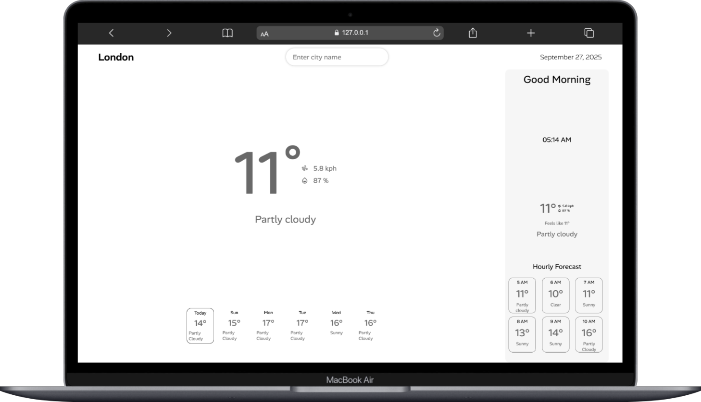

# 🌦️ Weather App  

A modern and responsive weather application built with **HTML, CSS, and JavaScript**.  
It fetches real-time weather data using the **WeatherAPI** and displays current weather, air quality, UV index, and a 7-day forecast.  

---

## 🚀 Features  
- 🌍 Search weather by city name  
- 📍 Get default city weather on page load  
- ⏰ Current time & location-based greeting (Good Morning, Evening, Night)  
- 🌡️ Real-time temperature, humidity, wind speed, and pressure  
- 🌤️ 6-hour forecast with dynamic time updates  
- 📅 6-day forecast with highlights for **Today**  
- 🌀 Air Quality Index (AQI) and UV Index with animations  
- 🎨 Responsive design with a beautiful loader while fetching data  

---

## 🖼️ Screenshots  

### 🌤️ Home Page  
 

---

## 🛠️ Tech Stack  
- **Frontend**: HTML, CSS, JavaScript  
- **API**: [WeatherAPI](https://www.weatherapi.com/)  
- **Icons**: Custom SVG / WeatherAPI condition icons  

---

## ⚡ Installation & Setup  

1. Clone this repository:  
   ```bash
   git clone https://github.com/your-username/weather-app.git
